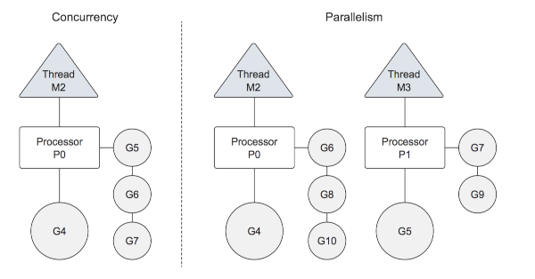

layout: true

.signature[@algogrit]

---
class: center, middle

# Why Go

Gaurav Agarwal

---

# Go

* simple, concurrent language

* Born @ Google

* Cross-compilation

* Go Toolchain

* Binaries!

---
class: center, middle

# Go's programming style

---
class: center, middle

## Syntax is close to C

---

```go
package main

import "fmt"

func main() {
  var aNumber int = 42

  fmt.Printf("Hello, world! %d", aNumber)
}
```

```bash
$ go run main.go
Hello, world! 42
```

---
class: center, middle

## Simplicity over complexity

---

```go
for i := 0; i < 10; i++ {
  //
}
```

---
class: center, middle

## Concurrency over parallelism

---
class: center, middle

What's the difference?

---
class: center, middle

Concurrency is the composition of independently executing processes, while parallelism is the simultaneous execution of (possibly related) computations.

.content-credits[https://blog.golang.org/concurrency-is-not-parallelism]

---
class: center, middle


.image-credits[https://github.com/sathishvj/optimizing-go-programs#m-p-g]

---
class: center, middle

## Neither Object-oriented nor functional in nature

---

* No classes *(it does have `structs`)*

* functions can return functions

* Lack of **generics** *(almost here! -> beta in 1.18)*

* No collect/reduce/fold etc.

  * *Though you could implement them yourself*

* No inheritance

---
class: center, middle

## Binaries

---
class: center, middle

Automation and Command-line tools - Go is a great tool to make complex automation tools for developers. Its fast, lightweight and follows unix “Do one thing. And do it well.”.

---
class: center, middle

DevOps is beginning to use more and more of golang.

---
class: center, middle

## *Others*

---

* Statically typed, type inferred language
* Pointers (with Memory-safety!)
* [Garbage collector](https://blog.golang.org/ismmkeynote)
* `struct` with receiver functions
* Implicit `interface`s
* `slices` & `maps`
* `goroutines`
* `channels`
* Testing and benchmarking
* UTF-8 by default
* Comprehensive standard library...
* and great documentation to go along with it!
* `Go-fmt`

---

# Companies using Go

* Google
* Uber
* Go-JEK
* Grab
* [SoundCloud](https://developers.soundcloud.com/blog/go-at-soundcloud)
* [CloudFlare](https://blog.cloudflare.com/go-at-cloudflare/)
* Basecamp
* Heroku
* YouTube
* [SpaceX](https://blog.not-a-kernel-guy.com/2015/10/16/1738/)
* [Dollar Shave Club](http://highscalability.com/blog/2016/9/13/the-dollar-shave-club-architecture-unilever-bought-for-1-bil.html)
* Cisco
* Salesforce
* Ericsson
* ...
* ...
* ...

---

### Dropbox

*Our entire infrastructure service layer has been rewritten in golang, 10s of thousands of servers running millions of hits per second.*

*Exabytes of data, moving around Tbps flows 24/7.*

*The infrastructure service layer -- data, metadata, monitoring, notifications, queueing, search etc--is go*

.content-credits[https://twitter.com/jamwt/status/629727590782099456]

---

### YouTube

*YouTube serves more than 4 billion hours of video each month. About 72 hours of video are uploaded to the service every minute. While YouTube stores all its videos directly on a file system, it uses MySQL to store all the metadata needed to serve each video, such as user preferences, advertising information, country customizations and other needed bits of information.*

*The 30,000 lines of code in Vitess can be compiled into binaries in about 30 seconds. And, thanks to a rich set of libraries, many tasks do not require that much programming. For instance, Sougoumarane wrote a 105-line routine that periodically trims log files, functionality that couldn't have been written in as few lines by using C or C++.*

*Vitess is a database clustering system for horizontal scaling of MySQL through generalized sharding.*

*Vitess has been a core component of YouTube's database infrastructure since 2011, and has grown to encompass tens of thousands of MySQL nodes.*

.content-credits[[from 2012](https://www.pcworld.com/article/2020581/youtube-scales-mysql-with-go-code.html)]

---

### Go-JEK

*We do comparable transport to Ola. We do double the Indian market for food deliveries, as per publicly reported numbers. That means if you take Swiggy and Zomato combined in terms of their published order volumes, we do twice that number. Our payments are of the same order of magnitude as Paytm’s. And we’re supporting all of this with just over 200 engineers across three locations: Jakarta, Singapore, and Bangalore.*

*Go-Jek had just switched to Golang or Go, a programming language created at Google in 2009. Paranjape wasn’t familiar with it back then. “Niranjan [Paranjape] re-wrote the allocation system in Golang, a language that he did not know, in three nights flat.*

*Our systems were running fine with 20,000 drivers and these many customers. Within 20 days the whole thing had gone up 4x.*

.content-credits[https://www.techinasia.com/gojek-insider-account-of-scaling-900x-doubling]

---

### Repustate

*Repustate provides text analytics services to small business, large enterprises and government organizations the world over. As the company has grown, so too has the strain on our servers. We process anywhere from 500 million to 1 billion pieces of text EACH day. Text comes in the form of tweets, news articles, blog comments, customer feedback forms and anything else our customers send our way.*

*We migrated our entire API stack from Python (First Django then Falcon) to Go, reducing the mean response time of an API call from 100ms to 10ms*

*We reduced the number of EC2 instances required by 85%*

*Because Go compiles to a single static binary and because Go 1.5 makes cross compilation a breeze, we can now ship a self-hosted version of Repustate that is identical to the one we host for customers. (Previously we shipped virtual machine appliances to customers which was a support nightmare)*

*Due to the similarity between Python and Go, we were able to quickly re-purpose our unit tests written in nose to fit the structure that Go requires with a just a few simple sed scripts.*

.content-credits[https://www.repustate.com/blog/migrating-entire-api-go-python/]

---

### *More*

* [Handling 1 Million Requests per Minute with Golang](https://medium.com/smsjunk/handling-1-million-requests-per-minute-with-golang-f70ac505fcaa)

* [How we monitor application performance at GO-JEK](https://blog.gojekengineering.com/how-we-monitor-application-performance-at-go-jek-5500d046da56)

* [Why Go Was the Right Choice for CockroachDB](https://www.cockroachlabs.com/blog/why-go-was-the-right-choice-for-cockroachdb/)

* [Go success stories from around the web](https://github.com/golang/go/wiki/SuccessStories)

---
class: center, middle

# Where Go doesn't shine?

---

* null pointer exceptions (`nil` in Go) - Billion dollar mistake!

* No functional programming paradigm (collect/reduce/fold)

* Dealing with errors (`return val, err`)

* Package Manager

  * Solved very recently - `go mod`

  * Old projects tend to use `dep`, `glide`, ...

---
class: center, middle

# Open Source Software

---

* Docker

* Kubernetes

* Hyperledger - Fabric

* CockroachDB

* Jaeger

* Terraform

* ...

---
class: center, middle

# Is Go only a systems programming language?

---

* Gomobile

* Gobots for IoT

* Go WASM

* Go for AI/ML (Using Tenserflow and otherwise too)

* Blockchain

---

# References

* [What is Go good for? - Quora](https://www.quora.com/What-is-golang-good-for)

* [Ask HN: What highly scalable thing have you built with Go](https://news.ycombinator.com/item?id=17440616)

* [Type of applications being developed in Go?](https://medium.com/@IndianGuru/type-of-applications-being-developed-in-go-8e5505165df5)

* [The pros and cons of programming in Go](https://willowtreeapps.com/ideas/the-pros-and-cons-of-programming-in-go)

* [For which purpose is the Go programming language used? - Quora](https://www.quora.com/For-which-purpose-is-the-Go-programming-language-used)

* [Go for AI/ML](https://github.com/esimov/pigo)

---
class: center, middle

## Workshop Code & Examples

https://github.com/AgarwalConsulting/Go-Training

## Slides

https://why-go.slides.algogrit.com
