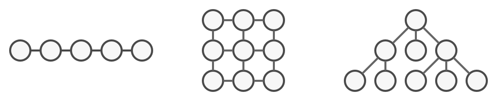
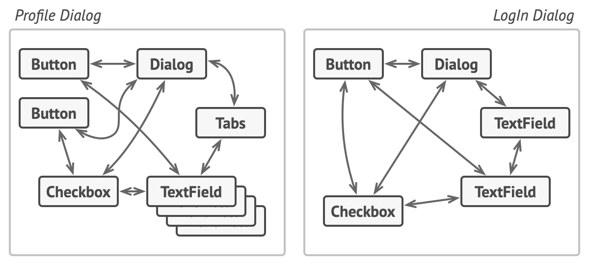
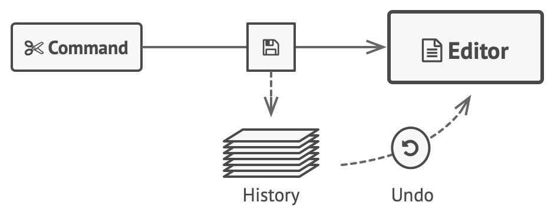
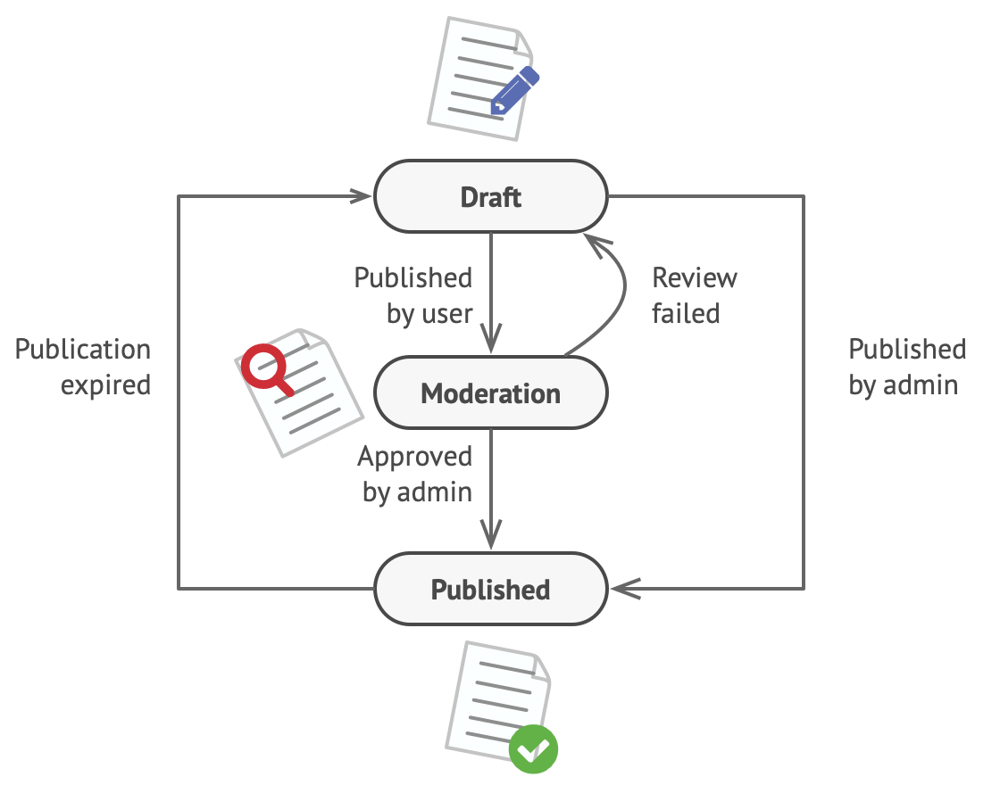

layout: true

.signature[@algogrit]

---
class: center, middle

# Go Design Patterns

Gaurav Agarwal

---
class: center, middle

## Who is this class for?

---

- Experienced Go developers

- Looking to skill up & work with more complex challenges

- Looking to refactor & simplify existing code bases

---
class: center, middle

## What are we going to learn?

---

- Why everything your friends know about factory patterns is wrong?

- Find out how `Starbuzz` coffee doubled their stock price with the Decorator pattern

- Avoiding those embarrassing coupling mistakes

- Discover the secrets of the pattern guru

.content-credits[https://www.oreilly.com/library/view/head-first-design/0596007124/]

---

class: center, middle

*What we wanted*


---

class: center, middle

*What we got*


---

## As an instructor

- I promise to

  - make this class as interactive as possible

  - use as many resources as available to keep you engaged

  - ensure everyone's questions are addressed

---

## What I need from you

- Be vocal

  - Let me know if there any audio/video issues ASAP

  - Feel free to interrupt me and ask me questions

- Be punctual

- Give feedback

- Work on the exercises

- Be *on mute* unless you are speaking

---
class: center, middle

## Class Progression

---
class: center, middle

Here you are trying to *learn* something, while here your *brain* is doing you a favor by making sure the learning doesn't stick!

.content-credits[https://www.oreilly.com/library/view/head-first-design/0596007124/]

---

### Some tips

- Slow down => stop & think
  - listen for the questions and answer

- Do the exercises
  - not add-ons; not optional

- There are no dumb questions!

- Drink water. Lots of it!

---

### Some tips (continued)

- Take notes
  - Try: *Repetitive Spaced Out Learning*

- Talk about it out loud

- Listen to your brain

- Design something

---
class: center, middle

### 📚 Content ` > ` 🕒 Time

---
class: center, middle

## Show of hands

*Yay's - in Chat*

---
class: center, middle

## Before we dive into patterns

---

- Methods, interfaces and inheritance

- **SOLID** principles

---
class: center, middle

### Methods, interfaces and inheritance

---
class: center, middle

#### Methods

---
class: center, middle

Methods are known as receivers or receiver functions in Go

---

- Receivers can be defined on any user-defined type in Go

- You can define multiple receivers with same name but on different receiver types, within a package

- They need to be defined in the same package as the `type` is defined in

- Getters & Setters are anti-patterns in Go

- Two kinds of receiver functions: *value* receivers & *pointer* receivers

---

##### Value receivers

- `func (<varName> <receiverType>) <funcNameA>() { ... }`
  - Eg. `func (f MyFloat) Abs() float64 { ... }`

---
class: center, middle

There is no `this` or `self` keyword in go, which could give you a hold of the variable on which you are dispatching a receiver.

---
class: center, middle

They are instead passed in to the receiver, the same way you have arguments to a function.

---

##### Pointer receivers

- `func (<varName> *<receiverType>) <funcNameB>() { ... }`
  - Eg. `func (v *Vertex) Scale(by float64) { ... }`

---

Pointer receivers can help in:

- Avoiding copy of a large-ish struct variable

- Update fields of a struct variable

- Useful for dispatching even on `nil` values

---

The value & pointer receivers can be dispatched interchangeably:

- `var v <receiverType>`
  - `v.funcNameA()` & `v.funcNameB()`

- `p := &v`
  - `p.funcNameA()` & `p.funcNameB()`

---
class: center, middle

#### Interfaces

---
class: center, middle

Interfaces are implicit in Go!

---

- `interface` keyword

- `type Foo interface { ... }`

- It contains only method definitions

---

##### Rules

1. If any type implements all of the methods required by the interface, only then it implicitly implements the interface

2. if a value type implements an interface, then the pointer to the value type also implements the interface

3. If any of the receiver methods, required by interface `I` on type `A` are pointer receiver, then only `*A` will be implementing an interface

---

```go
type I interface {
  Foo()
  Bar()
}

type A struct{}

func (a *A) Foo() {}

func (a A) Bar() {}
```

then,

```go
var i I

// i = A{} // Will result in compiler error

i = &A{}
```

---
class: center, middle

#### Inheritance

---
class: center, middle

go has inheritance through *composition*!

---
class: center, middle

##### Struct "inheritance"

---
class: center, middle

A struct type can compose or "embed" another type

---

```go
type Bar string

func (b Bar) bar() {}

type Foo struct {
  Bar
  // Bar Bar
}
```

---

- Here the custom type `Foo` "inherits" Bar's bar method

- If a struct composes a struct, it can also "inherit" Fields

---
class: center, middle

Multiple inheritance is possible and easy to deal with

---
class: center, middle

##### Interface "inheritance"

---
class: center, middle

An interface can compose another interface

---
class: center, middle

## Software Design

---
class: center, middle

### Code Reviews

---
class: center, middle

What makes you say "that code is ugly" or "wow that code is beautiful"?

---
class: center, middle

### Bad code!?

---
class: center, middle

What are some of the properties of bad code that you might pick up on in code review?

---

- *Rigid*. Is the code rigid? Does it have a straight jacket of overbearing types and parameters, that making modification difficult?

- *Fragile*. Is the code fragile? Does the slightest change ripple through the code base causing untold havoc?

- *Immobile*. Is the code hard to refactor? Is it one keystroke away from an import loop?

- *Complex*. Is there code for the sake of having code, are things over-engineered?

- *Verbose*. Is it just exhausting to use the code? When you look at it, can you even tell what this code is trying to do?

.content-credits[https://dave.cheney.net/2016/08/20/solid-go-design]

---
class: center, middle

### Good Design

---
class: center, middle

### **SOLID** principles

.content-credits[https://dave.cheney.net/2016/08/20/solid-go-design]

---
class: center, middle

#### Single-Responsibity principle

---
class: center, middle

> A class should have one, and only one, reason to change. - Robert C Martin

---

- Coupling & Cohesion

Coupling is simply a word that describes two things changing together – a movement in one induces a movement in another.

In the context of software, cohesion is the property of describing pieces of code are naturally attracted to one another.

---

- Package names

A package’s name is both a description of its purpose, and a name space prefix.

---

- Bad package names

What does package `server` provide?... well a server, hopefully, but which protocol?

What does package `private` provide? Things that I should not see? Should it have any public symbols?

And package `common`, just like its partner in crime, package `utils`, is often found close by these other offenders.

---
class: center, middle

Catch all packages like these become a dumping ground for miscellany, and because they have many responsibilities they change frequently and without cause.

---

##### Go's UNIX philosophy

> Do one thing, and do it well.

---
class: center, middle

#### Open / Closed Principle

---
class: center, middle

> Software entities should be open for extension, but closed for modification. - Bertrand Meyer

---
class: center, middle

Go does not support function overloading or even overriding

---
class: center, middle

#### Liskov Substitution principle

---
class: center, middle

> Coined by Barbara Liskov, the Liskov substitution principle states, roughly, that two types are substitutable if they exhibit behaviour such that the caller is unable to tell the difference.

---
class: center, middle

> In a class based language, Liskov’s substitution principle is commonly interpreted as a specification for an abstract base class with various concrete subtypes. But Go does not have classes, or inheritance, so substitution cannot be implemented in terms of an abstract class hierarchy.

---
class: center, middle

##### Interface

---
class: center, middle

> Require no more, promise no less. – Jim Weirich

---
class: center, middle

#### Interface segregation principle

---
class: center, middle

> Clients should not be forced to depend on methods they do not use. - Robert C Martin

---
class: center, middle

In Go, the application of the interface segregation principle can refer to a process of isolating the behavior required for a function to do its job.

---
class: center, middle

> A great rule of thumb for Go is **accept interfaces, return structs**. - Jack Lindamood

---
class: center, middle

#### Dependency Inversion principle

---
class: center, middle

> High-level modules should not depend on low-level modules. Both should depend on abstractions.
> Abstractions should not depend on details. Details should depend on abstractions.
> – Robert C. Martin

---

- If you’ve applied all the principles we’ve talked about up to this point then your code should already be factored into discrete packages, each with a single well defined responsibility or purpose.

- Your code should describe its dependencies in terms of interfaces, and those interfaces should be factored to describe only the behaviour those functions require.

---
class: center, middle

> In other words, there shouldn’t be much left to do.

---
class: center, middle

In Go, your import graph must be acyclic. A failure to respect this acyclic requirement is grounds for a compilation failure, but more gravely represents a serious error in design.

---

class: center, middle


---

#### Layers

- Entities (entities)

  Defines all the Models in the application

- Repository

  Encapsulates the interaction with the database. This is the lowest layer in the application.

- Services

  Orchestrates the interaction with repository and other services.

---

#### Layers (continued)

- Transport

  Encapsulates the interaction with application over an http API

- Binaries

  The code in `cmd/server` ties all the layers together, in order the start the app.

---
class: center, middle

Sample App: [YAES Server](https://github.com/algogrit/yaes-server)

---

#### SOLID - summary

The Single Responsibility Principle encourages you to structure the functions, types, and methods into packages that exhibit natural cohesion; the types belong together, the functions serve a single purpose.

The Open / Closed Principle encourages you to compose simple types into more complex ones using embedding.

The Liskov Substitution Principle encourages you to express the dependencies between your packages in terms of interfaces, not concrete types. By defining small interfaces, we can be more confident that implementations will faithfully satisfy their contract.

---

#### SOLID - summary (continued)

The Interface Substitution Principle takes that idea further and encourages you to define functions and methods that depend only on the behaviour that they need. If your function only requires a parameter of an interface type with a single method, then it is more likely that this function has only one responsibility.

The Dependency Inversion Principle encourages you move the knowledge of the things your package depends on from compile time–in Go we see this with a reduction in the number of import statements used by a particular package–to run time.

---
class: center, middle

> interfaces let you apply the SOLID principles to Go programs. - Dave Cheney

---
class: center, middle

> **Design** is the art of arranging code that needs to work today, and to be easy to change forever. - Sandi Metz

---
class: center, middle

### Design Patterns

---
class: center, middle

Design patterns are typical solutions to commonly occurring problems in software design. They are like pre-made blueprints that you can customize to solve a recurring design problem in your code.

---
class: center, middle

There are at least 24 known design patterns.

.content-credits[https://refactoring.guru/design-patterns/catalog]

---
class: center, middle


.content-credits[https://refactoring.guru/design-patterns/catalog]

---
class: center, middle


.content-credits[Design Patterns: Elements of Reusable Object-Oriented Software by GoF]

---

Patterns can be categorized into 3:

- Creational

- Structural

- Behavioral

---
class: center, middle

#### Creational Patterns

---
class: center, middle

*Creational* design patterns abstract the instantiation process. They help make a system independent of how it's objects are created, composed and represented.

---
class: center, middle

The basic form of object creation could result in design problems or in added complexity to the design. *Creational* design patterns solve this problem by somehow controlling this object creation.

---

- Builder

- Factories

- Prototype

- Singleton

---
class: center, middle

##### Builder Pattern

---
class: center, middle

Lets you construct complex objects step by step. The pattern allows you to produce different types and representations of an object using the same construction code.

---

Imagine a complex object that requires laborious, step-by-step initialization of many fields and nested objects. Such initialization code is usually buried inside a monstrous constructor with lots of parameters. Or even worse: scattered all over the client code.

---
class: center, middle


---
class: center, middle


---
class: center, middle

##### Factory Pattern

---
class: center, middle

The Factory Method pattern suggests that you replace direct object construction calls with calls to a special factory method.

---

Imagine that you’re creating a logistics management application. The first version of your app can only handle transportation by trucks, so the bulk of your code lives inside the Truck class.

At present, most of your code is coupled to the Truck class. Adding Ships into the app would require making changes to the entire codebase. Moreover, if later you decide to add another type of transportation to the app, you will probably need to make all of these changes again.

---
class: center, middle


---
class: center, middle

##### Prototype Pattern

---
class: center, middle

*Prototype* is a creational design pattern that lets you copy existing objects without making your code dependent on their classes.

---

Say you have an object, and you want to create an exact copy of it. How would you do it? First, you have to create a new object of the same class. Then you have to go through all the fields of the original object and copy their values over to the new object.

---
class: center, middle


---
class: center, middle

To perform a copy of a prototype, we need to be able to perform a **deep copy**

---

- The Prototype pattern delegates the cloning process to the actual objects that are being cloned.

- The pattern declares a common interface for all objects that support cloning.

- This interface lets you clone an object without coupling your code to the class of that object.

- Usually, such an interface contains just a single clone method.

---
class: center, middle

##### Singleton Pattern

---
class: center, middle

*Singleton* is a creational design pattern that lets you ensure that a class has only one instance, while providing a global access point to this instance.

---

Why would anyone want to control how many instances a class has?

- The most common reason for this is to control access to some shared resource—for example, a database or a file.

- Or the construction call is expensive.

- Or provide a global access point to that instance.

---
class: center, middle


---
class: center, middle

> When discussing which patterns to drop, we found that we still love them all. (Not really -- I'm in favor of dropping Singleton. It's use is almost always a design smell.) - Elrich Gamma

---

###### Cons of Singleton

- Violates the Single Responsibility Principle. The pattern solves two problems at the time.

- The Singleton pattern can mask bad design, for instance, when the components of the program know too much about each other.

---

###### Cons of Singleton (continued)

- The pattern requires special treatment in a multi-threaded environment so that multiple threads won’t create a singleton object several times.

- It may be difficult to unit test the client code of the Singleton because many test frameworks rely on inheritance when producing mock objects. Since the constructor of the singleton class is private and overriding static methods is impossible in most languages, you will need to think of a creative way to mock the singleton. Or just don’t write the tests. Or don’t use the Singleton pattern.

---
class: center, middle

#### Structural Patterns

---
class: center, middle

*Structural* patterns are concerned with how objects are composed of to form large structures.

---

Structural patterns explain how to assemble objects and classes into larger structures while keeping these structures flexible and efficient.

Structural design patterns are design patterns that ease the design by identifying a simple way to realize relationships between entities.

---

- Adapter

- Bridge

- Composite

- Decorator

- Facade

- Flyweight

- Proxy

---
class: center, middle

##### Adapter Pattern

---
class: center, middle

*Adapter* is a structural design pattern that allows objects with incompatible interfaces to collaborate.

---

Imagine that you’re creating a stock market monitoring app. The app downloads the stock data from multiple sources in XML format and then displays nice-looking charts and diagrams for the user.

At some point, you decide to improve the app by integrating a smart 3rd-party analytics library. But there’s a catch: the analytics library only works with data in JSON format.

You could change the library to work with XML. However, this might break some existing code that relies on the library. And worse, you might not have access to the library’s source code in the first place, making this approach impossible.

---
class: center, middle


---
class: center, middle

A construct which adapts an existing interface X to conform to existing interface Y.

---
class: center, middle

##### Bridge Pattern

---
class: center, middle

*Bridge* is a structural design pattern that divides business logic or huge class into separate class hierarchies that can be developed independently.

---

- Decouples an interface from its implementation so that the two can vary independently

- Bridge prevents a `Cartesian product` complexity explosion

---

Say you have a geometric Shape class with a pair of subclasses: Circle and Square. You want to extend this class hierarchy to incorporate colors, so you plan to create Red and Blue shape subclasses. However, since you already have two subclasses, you’ll need to create four class combinations such as BlueCircle and RedSquare.

Adding new shape types and colors to the hierarchy will grow it exponentially. For example, to add a triangle shape you’d need to introduce two subclasses, one for each color. And after that, adding a new color would require creating three subclasses, one for each shape type. The further we go, the worse it becomes.

---
class: center, middle


---
class: center, middle

Bridge lets you split a large class or a set of closely related classes into two separate hierarchies—abstraction and implementation—which can be developed independently of each other.

---
class: center, middle

**Hollywood Principle** states: *"Don't Call Us, We'll Call You."*

---
class: center, middle

##### Composite Pattern

---
class: center, middle

*Composite* is a structural design pattern that lets you compose objects into tree structures and then work with these structures as if they were individual objects.

---

- Composition lets us make compound objects

- Using the Composite pattern makes sense only when the core model of your app can be represented as a tree.

- The Composite pattern lets you run a behavior recursively over all components of an object tree.

---

Imagine that you have two types of objects: Products and Boxes. A Box can contain several Products as well as a number of smaller Boxes. These little Boxes can also hold some Products or even smaller Boxes, and so on.

Say you decide to create an ordering system that uses these classes. Orders could contain simple products without any wrapping, as well as boxes stuffed with products...and other boxes. How would you determine the total price of such an order?

---
class: center, middle


---
class: center, middle

A mechanism for treating individual (scalar) objects and compositions of objects in a uniform manner.

---
class: center, middle

##### Decorator

---
class: center, middle

*Decorator* is a structural design pattern that lets you attach new behaviors to objects by placing these objects inside special wrapper objects that contain the behaviors.

---

- Want to augment an object with additional functionality

- Do not want to rewrite or alter existing code (OCP)

- Want to keep new functionality separate (SRP)

Solution: Embed the objects

---

Imagine that you’re working on a notification library which lets other programs notify their users about important events.

The initial version of the library was based on the Notifier class that had only a few fields, a constructor and a single send method.

At some point, you realize that users of the library expect more than just email notifications. Many of them would like to receive an SMS about critical issues. Others would like to be notified on Facebook and, of course, the corporate users would love to get Slack notifications.

How hard can that be? You extended the Notifier class and put the additional notification methods into new subclasses. Now the client was supposed to instantiate the desired notification class and use it for all further notifications.

But then someone reasonably asked you, "Why can’t you use several notification types at once? If your house is on fire, you’d probably want to be informed through every channel."

---
class: center, middle


---
class: center, middle

Decorator pattern is often used to emulate multiple inheritance

---
class: center, middle

##### Facade Pattern

---
class: center, middle

*Facade* is a structural design pattern that provides a simplified interface to a library, a framework, or any other complex set of classes.

---

- Balancing complexity and presentation/usability

- A facade is a class that provides a simple interface to a complex subsystem which contains lots of moving parts.

- A facade might provide limited functionality in comparison to working with the subsystem directly. However, it includes only those features that clients really care about.

- Having a facade is handy when you need to integrate your app with a sophisticated library that has dozens of features, but you just need a tiny bit of its functionality.

---

Imagine that you must make your code work with a broad set of objects that belong to a sophisticated library or framework. Ordinarily, you’d need to initialize all of those objects, keep track of dependencies, execute methods in the correct order, and so on.

As a result, the business logic of your classes would become tightly coupled to the implementation details of 3rd-party classes, making it hard to comprehend and maintain.

- Check account
- Check security PIN
- Credit/debit balance
- Make ledger entry
- Send notification

---
class: center, middle


---
class: center, middle

Build a *Facade* to provide a simplified API over a set of components

---
class: center, middle

##### Flyweight Pattern

---
class: center, middle

*Flyweight* is a structural design pattern that lets you fit more objects into the available amount of RAM by sharing common parts of state between multiple objects instead of keeping all of the data in each object.

---

To have some fun after long working hours, you decided to create a simple video game: players would be moving around a map and shooting each other. You chose to implement a realistic particle system and make it a distinctive feature of the game. Vast quantities of bullets, missiles, and shrapnel from explosions should fly all over the map and deliver a thrilling experience to the player.

Upon its completion, you pushed the last commit, built the game and sent it to your friend for a test drive. Although the game was running flawlessly on your machine, your friend wasn’t able to play for long. On his computer, the game kept crashing after a few minutes of gameplay. After spending several hours digging through debug logs, you discovered that the game crashed because of an insufficient amount of RAM. It turned out that your friend’s rig was much less powerful than your own computer, and that’s why the problem emerged so quickly on his machine.

---

class: center, middle


---
class: center, middle

Flyweight is space optimization technique that lets us use less memory by storing externally the data associated with similar objects.

---
class: center, middle

##### Proxy Pattern

---
class: center, middle

*Proxy* is a structural design pattern that lets you provide a substitute or placeholder for another object. A proxy controls access to the original object, allowing you to perform something either before or after the request gets through to the original object.

---

Why would you want to control access to an object? Here is an example: you have a massive object that consumes a vast amount of system resources. You need it from time to time, but not always.

You could implement lazy initialization: create this object only when it’s actually needed. All of the object’s clients would need to execute some deferred initialization code. Unfortunately, this would probably cause a lot of code duplication.

---

class: center, middle


---
class: center, middle

Proxy is a type that functions as an interface to a particular resource. That resource may be remote, expensive to construct, or may require logging or some other added functionality.

---

###### Proxy vs Decorator

- Proxy tries to provide an identical interface; decorator provides an enhanced interface

- Decorator typically aggregates (or has pointer to) what it is decorating; proxy doesn't have to

- Proxy might not even be working with a materialized object

---
class: center, middle

#### Behavioral Patterns

---
class: center, middle

*Behavioral* patterns are concerned with algorithms and the assignment of responsibilities between objects.

---
class: center, middle

Behavioral patterns describe not just patterns of objects but also the patterns of communication between them.

---

- Chain of Responsibility
- Command
- Interpreter
- Iterator
- Mediator
- Memento
- Observer
- State
- Strategy
- Template Method
- Visitor

---
class: center, middle

##### Chain of Responsibility

---
class: center, middle

*Chain of Responsibility* is behavioral design pattern that allows passing request along the chain of potential handlers until one of them handles request.

---
class: center, middle

Upon receiving a request, each handler decides either to process the request or to pass it to the next handler in the chain.

The pattern allows multiple objects to handle the request without coupling sender class to the concrete classes of the receivers. The chain can be composed dynamically at runtime with any handler that follows a standard handler interface.

---

Imagine that you’re working on an online ordering system. You want to restrict access to the system so only authenticated users can create orders. Also, users who have administrative permissions must have full access to all orders.

After a bit of planning, you realized that these checks must be performed sequentially. The application can attempt to authenticate a user to the system whenever it receives a request that contains the user’s credentials. However, if those credentials aren’t correct and authentication fails, there’s no reason to proceed with any other checks.

---

During the next few months, you implemented several more of those sequential checks.

- One of your colleagues suggested that it’s unsafe to pass raw data straight to the ordering system. So you added an extra validation step to sanitize the data in a request.

- Later, somebody noticed that the system is vulnerable to brute force password cracking. To negate this, you promptly added a check that filters repeated failed requests coming from the same IP address.

- Someone else suggested that you could speed up the system by returning cached results on repeated requests containing the same data. Hence, you added another check which lets the request pass through to the system only if there’s no suitable cached response.

---

class: center, middle


---

- Like many other behavioral design patterns, the Chain of Responsibility relies on transforming particular behaviors into stand-alone objects called handlers. In our case, each check should be extracted to its own class with a single method that performs the check. The request, along with its data, is passed to this method as an argument.

- The pattern suggests that you link these handlers into a chain. Each linked handler has a field for storing a reference to the next handler in the chain. In addition to processing a request, handlers pass the request further along the chain. The request travels along the chain until all handlers have had a chance to process it.

---
class: center, middle

A chain of components who all get a chance to process a command or a query, optionally having default processing implementation & an ability to terminate the processing chain.

---

Application of CoR Pattern

- Command query Separation

---
class: center, middle

Command = asking for an action or change

Query = asking for information

CQS = having separate means of sending commands & queries to

---
class: center, middle

##### Command

---
class: center, middle

*Command* is a behavioral design pattern that turns a request into a stand-alone object that contains all information about the request. This transformation lets you pass requests as a method arguments, delay or queue a request’s execution, and support undoable operations.

---

Imagine that you’re working on a new text-editor app. Your current task is to create a toolbar with a bunch of buttons for various operations of the editor. You created a very neat Button class that can be used for buttons on the toolbar, as well as for generic buttons in various dialogs.

While all of these buttons look similar, they’re all supposed to do different things. Where would you put the code for the various click handlers of these buttons? The simplest solution is to create tons of subclasses for each place where the button is used. These subclasses would contain the code that would have to be executed on a button click.

Before long, you realize that this approach is deeply flawed. First, you have an enormous number of subclasses, and that would be okay if you weren’t risking breaking the code in these subclasses each time you modify the base Button class. Put simply, your GUI code has become awkwardly dependent on the volatile code of the business logic.

---

class: center, middle


---
class: center, middle

An object which represents an instruction to perform a particular action. Contains all the information necessary for the action to be taken.

---
class: center, middle

##### Interpreter

---
class: center, middle

Given a language, define a representation for its grammar along with an interpreter that uses the representation to interpret sentences in the language.

---
class: center, middle

A component that processes structured text data. Does so by turning it into separate lexical tokens (lexing) and then interpreting sequences of said tokens (parsing).

---
class: center, middle

##### Iterator

---
class: center, middle

*Iterator* is a behavioral design pattern that lets you traverse elements of a collection without exposing its underlying representation (list, stack, tree, etc.).

---

Most collections store their elements in simple lists. However, some of them are based on stacks, trees, graphs and other complex data structures.

But no matter how a collection is structured, it must provide some way of accessing its elements so that other code can use these elements. There should be a way to go through each element of the collection without accessing the same elements over and over.

This may sound like an easy job if you have a collection based on a list. You just loop over all of the elements. But how do you sequentially traverse elements of a complex data structure, such as a tree? For example, one day you might be just fine with depth-first traversal of a tree. Yet the next day you might require breadth-first traversal. And the next week, you might need something else, like random access to the tree elements.

---
class: center, middle



---
class: center, middle

Iterator facilitates the traversal of a data structure.

---
class: center, middle

##### Mediator

---
class: center, middle

*Mediator* is a behavioral design pattern that lets you reduce chaotic dependencies between objects. The pattern restricts direct communications between the objects and forces them to collaborate only via a mediator object.

---

Say you have a dialog for creating and editing customer profiles. It consists of various form controls such as text fields, checkboxes, buttons, etc.

Some of the form elements may interact with others. For instance, selecting the “I have a dog” checkbox may reveal a hidden text field for entering the dog’s name. Another example is the submit button that has to validate values of all fields before saving the data.

By having this logic implemented directly inside the code of the form elements you make these elements’ classes much harder to reuse in other forms of the app. For example, you won’t be able to use that checkbox class inside another form, because it’s coupled to the dog’s text field. You can use either all the classes involved in rendering the profile form, or none at all.

---
class: center, middle



---
class: center, middle

The Mediator pattern suggests that you should cease all direct communication between the components which you want to make independent of each other. Instead, these components must collaborate indirectly, by calling a special mediator object that redirects the calls to appropriate components. As a result, the components depend only on a single mediator class instead of being coupled to dozens of their colleagues.

---
class: center, middle

##### Memento

---
class: center, middle

*Memento* is a behavioral design pattern that lets you save and restore the previous state of an object without revealing the details of its implementation.

---

Imagine that you’re creating a text editor app. In addition to simple text editing, your editor can format text, insert inline images, etc.

At some point, you decided to let users undo any operations carried out on the text. This feature has become so common over the years that nowadays people expect every app to have it. For the implementation, you chose to take the direct approach. Before performing any operation, the app records the state of all objects and saves it in some storage. Later, when a user decides to revert an action, the app fetches the latest snapshot from the history and uses it to restore the state of all objects.

---

Let’s think about those state snapshots. How exactly would you produce one? You’d probably need to go over all the fields in an object and copy their values into storage. However, this would only work if the object had quite relaxed access restrictions to its contents. Unfortunately, most real objects won’t let others peek inside them that easily, hiding all significant data in private fields.

Ignore that problem for now and let’s assume that our objects behave like hippies: preferring open relations and keeping their state public. While this approach would solve the immediate problem and let you produce snapshots of objects’ states at will, it still has some serious issues. In the future, you might decide to refactor some of the editor classes, or add or remove some of the fields. Sounds easy, but this would also require changing the classes responsible for copying the state of the affected objects.

---
class: center, middle



---
class: center, middle

##### Observer

---
class: center, middle

*Observer* is a behavioral design pattern that lets you define a subscription mechanism to notify multiple objects about any events that happen to the object they’re observing.

---

Imagine that you have two types of objects: a Customer and a Store. The customer is very interested in a particular brand of product (say, it’s a new model of the iPhone) which should become available in the store very soon.

The customer could visit the store every day and check product availability. But while the product is still en route, most of these trips would be pointless.

---
class: center, middle


---
class: center, middle

##### State

---
class: center, middle

*State* is a behavioral design pattern that lets an object alter its behavior when its internal state changes. It appears as if the object changed its class.

---
class: center, middle

The State pattern is closely related to the concept of a *Finite-State Machine*.

---
class: center, middle

The main idea is that, at any given moment, there’s a finite number of states which a program can be in. Within any unique state, the program behaves differently, and the program can be switched from one state to another instantaneously. However, depending on a current state, the program may or may not switch to certain other states. These switching rules, called transitions, are also finite and predetermined.

--

Imagine that we have a Document class. A document can be in one of three states: Draft, Moderation and Published. The publish method of the document works a little bit differently in each state:

- In `Draft`, it moves the document to moderation.

- In `Moderation`, it makes the document public, but only if the current user is an administrator.

- In `Published`, it doesn’t do anything at all.

---
class: center, middle



---
class: center, middle

##### Strategy

---
class: center, middle

*Strategy* is a behavioral design pattern that lets you define a family of algorithms, put each of them into a separate class, and make their objects interchangeable.

---

One day you decided to create a navigation app for casual travelers. The app was centered around a beautiful map which helped users quickly orient themselves in any city.

One of the most requested features for the app was automatic route planning. A user should be able to enter an address and see the fastest route to that destination displayed on the map.

---

The first version of the app could only build the routes over roads. People who traveled by car were bursting with joy. But apparently, not everybody likes to drive on their vacation. So with the next update, you added an option to build walking routes. Right after that, you added another option to let people use public transport in their routes.

However, that was only the beginning. Later you planned to add route building for cyclists. And even later, another option for building routes through all of a city’s tourist attractions.

---

While from a business perspective the app was a success, the technical part caused you many headaches. Each time you added a new routing algorithm, the main class of the navigator doubled in size. At some point, the beast became too hard to maintain.

Any change to one of the algorithms, whether it was a simple bug fix or a slight adjustment of the street score, affected the whole class, increasing the chance of creating an error in already-working code.

In addition, teamwork became inefficient. Your teammates, who had been hired right after the successful release, complain that they spend too much time resolving merge conflicts. Implementing a new feature requires you to change the same huge class, conflicting with the code produced by other people.

---
class: center, middle


---
class: center, middle

The Strategy pattern suggests that you take a class that does something specific in a lot of different ways and extract all of these algorithms into separate classes called strategies.

---
class: center, middle

##### Template Method

---
class: center, middle

*Template Method* is a behavioral design pattern that defines the skeleton of an algorithm in the superclass but lets subclasses override specific steps of the algorithm without changing its structure.

---

Imagine that you’re creating a data mining application that analyzes corporate documents. Users feed the app documents in various formats (PDF, DOC, CSV), and it tries to extract meaningful data from these docs in a uniform format.

The first version of the app could work only with DOC files. In the following version, it was able to support CSV files. A month later, you “taught” it to extract data from PDF files.

At some point, you noticed that all three classes have a lot of similar code. While the code for dealing with various data formats was entirely different in all classes, the code for data processing and analysis is almost identical. Wouldn’t it be great to get rid of the code duplication, leaving the algorithm structure intact?

---
class: center, middle


---
class: center, middle

The Template Method pattern suggests that you break down an algorithm into a series of steps, turn these steps into methods, and put a series of calls to these methods inside a single template method. The steps may either be abstract, or have some default implementation. To use the algorithm, the client is supposed to provide its own subclass, implement all abstract steps, and override some of the optional ones if needed (but not the template method itself).

---
class: center, middle

##### Visitor

---
class: center, middle

*Visitor* is a behavioral design pattern that lets you separate algorithms from the objects on which they operate.

---

Imagine that your team develops an app which works with geographic information structured as one colossal graph. Each node of the graph may represent a complex entity such as a city, but also more granular things like industries, sightseeing areas, etc. The nodes are connected with others if there’s a road between the real objects that they represent. Under the hood, each node type is represented by its own class, while each specific node is an object.

At some point, you got a task to implement exporting the graph into XML format. At first, the job seemed pretty straightforward. You planned to add an export method to each node class and then leverage recursion to go over each node of the graph, executing the export method. The solution was simple and elegant: thanks to polymorphism, you weren’t coupling the code which called the export method to concrete classes of nodes.

---

Unfortunately, the system architect refused to allow you to alter existing node classes. He said that the code was already in production and he didn’t want to risk breaking it because of a potential bug in your changes.

Besides, he questioned whether it makes sense to have the XML export code within the node classes. The primary job of these classes was to work with geodata. The XML export behavior would look alien there.

---
class: center, middle


---
class: center, middle

The Visitor pattern suggests that you place the new behavior into a separate class called visitor, instead of trying to integrate it into existing classes. The original object that had to perform the behavior is now passed to one of the visitor’s methods as an argument, providing the method access to all necessary data contained within the object.

---

class: center, middle

Code
https://github.com/AgarwalConsulting/Go-Training/tree/master/patterns/design

Slides
https://go-design-patterns.slides.algogrit.com
