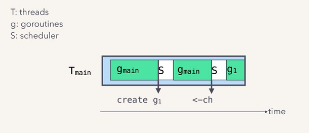

layout: true

.signature[@algogrit]

---

class: center, middle

# Go Fundamentals

Gaurav Agarwal

---
class: center, middle

Go is a compiled language. Every program needs to be compiled before it can be run!

---

## Overview of Go scheduler

- OS threads are kernel-space threads

- goroutines are user-space threads, lighter than OS threads

- Go's scheduler is responsible for mapping goroutines on to OS threads

- For `m` running goroutines, the scheduler maps them to `n` threads

---

- The scheduler maintains a run queue for each thread

- Threads can steal work from other threads when their run queue is empty

- `GOMAXPROCS` controls the max number of OS threads a go program can create

- Goroutines don't run to completion,

  - They are pre-emptively scheduled

  - And they can be context switched when blocked

---

### OS vs Go Scheduler


.image-credits[https://speakerdeck.com/kavya719/the-scheduler-saga?slide=15]

---

### OS Thread & Go Routine Scheduling



.image-credits[https://speakerdeck.com/kavya719/the-scheduler-saga?slide=18]

---
class: center, middle

## Looking at `scratchpad.go`

---

## Running & Building

- `go build`

  > for compiling go program into a binary

- `go run`

  > for compiling and running the binary immediately

---

### Env variables

- `GOOS`

- `GOARCH`

[Possible values](https://gist.github.com/asukakenji/f15ba7e588ac42795f421b48b8aede63)

---
class: center, middle

## Naming conventions

---

- package names, directories, filenames

  > `snake_case`

- exported functions, variables, const, types

  > `PascalCase` / `UpperCamelCase`

- non-exported functions, variables, const, types

  > `lowerCamelCase`

---
class: center, middle

## Types

---
class: center, middle

Go is a statically typed, type inferred language!

---
class: center, middle

i.e.) You don't have to write a type of a variable explicitly, the compiler will infer it. But all types must be known/inferred at compile time.

---

### Variables

- `var` keyword

#### Declaration & Initialization

- `var <name> <type>`

- `var <name> = <val>`

- `<name> := <val>`

---

## `builtin` types

```go
bool

string

int  int8  int16  int32  int64
uint uint8 uint16 uint32 uint64 uintptr

byte // alias for uint8

rune // alias for int32
     // represents a Unicode code point

float32 float64

complex64 complex128
```

---

- [Basic types](https://tour.golang.org/basics/11)

  - defined in the [`builtin`](https://golang.org/pkg/builtin/) package

- Know type information using `%T` [formatter](https://golang.org/pkg/fmt/)

- Type aliases using `type` keyword

---

## Default values

- zero values

---

- multiple assignment

```go
var i, j = "Hello", 42
```

---
class: center, middle

## Type conversion

---

- `<type>(<val-of-other-type>)`

  - Eg: `val := int(42.00)`

---

- Specialized type conversion

  - `strconv`

  - `math`

  - ...

---
class: center, middle

## Constants

---

- `const` keyword

---

### Paired with `type` keyword, can be powerful

- `iota` built-in

---

#### `const` in the `time` package

- [`time.Weekday`](https://golang.org/pkg/time/#Weekday)

- [`time.Month`](https://golang.org/pkg/time/#Month)

- [`time.Duration`](https://golang.org/pkg/time/#Duration)

  - [Constants](https://golang.org/pkg/time/#pkg-constants)

---
class: center, middle

## Flow Control

---

### For

- normal `for <init>; <condition>; <post> {`

- while `for <condition> {`

- forever `for {`
  - can control execution using `break` & `continue`

---

### if

- with [statements](https://tour.golang.org/flowcontrol/6)

- `if <statement>; <condition> {`

  - `var`s declared within statement are available only within `if / else if / else` block

---

### [Switch statements](https://gobyexample.com/switch)

- no break

- statements are optional

- top-down execution - where execution stops after a case succeeds

- normal `switch <value> { case <match>`

- takes statement `switch <statement>; <value> { case <match>`

- conditional `switch { case <bool-statement>: `
  - `if-else-if`

---

### [Ranges](https://gobyexample.com/range)

- `for` along with `range`

  - range returns `index` & `element`

  - `for index, element := range "abc" {`

  - `for <index>, <value> := range <var> {`

- For maps *we will take a look at DS next*
  - `for <key>, <value> := range <map-type> {`

---
class: center, middle

## Import & Exports

---

### Packages

- Every `.go` file starts with `package <name>`

- `func main` can only be defined in a `main` package

- All `.go` files in a directory need to belong to the same package

- Every package needs to be in a directory of the same name (*)

  - Except `main` package

`*: More of a thumb rule`

---

### Imports

Import path is always relative to `$GOPATH/src` (*)

`*: True only for Go versions <1.13`

---
class: center, middle

> *unless you are using `go mod`*

---
class: center, middle

### Exports

Works using the first character -> *U*ppercase means exported

---
class: center, middle

## DS

---

### Arrays

- `var <name> [<length>]int`

- `len` & `cap` from `builtin`

- zero values?

---
class: center, middle

*Go's declaration [syntax](https://blog.golang.org/declaration-syntax)*

---

### [Slices](https://blog.golang.org/slices-intro)

- `var <name> []int`

- References to underlying array

- `append`

  - Eg. `append(s, <element1>, <element2>, ...)`

  - You have to assign it back to `s` or whatever is your slice variable name

  - Can have a different behavior depending on capacity

- `make([]<type>, len, cap)`

- `make([]<type>, lenAndCap)`

---

- zero value of slices?

---

### Intro to structs

- Store related fields of different types

- `struct` keyword

  - Usage along with `type` keyword

  - Anonymous structs

- Struct Literal syntax

---

- zero value of structs?

---

### Maps

- `map` keyword
  - `map[<keyType>]<valType>`

- `make(map[string]Person)`

- `len` only

- `delete`
  - Eg. `delete(m, <key>)`

- lookup returns 2 values - `val, ok`

---

- zero value of maps?

---

- They need to be initialized before usage either with

  - `make`

  > `make(map[string]Person)`

  or

  - `map` literal syntax

  > `map[string]Person{}`

---

### Custom

- [generics](https://go.googlesource.com/proposal/+/refs/heads/master/design/go2draft-type-parameters.md) are coming in Go ~~2~~ 1.18!

- Till then rely on `interface{}` or implement a DS for specific types

---
class: center, middle

Oops! We haven't talked about interfaces yet!

---
class: center, middle

### Strings

as `[]byte` or `[]rune`

---
class: center, middle

> What happens to variables when we pass them to functions?

---
class: center, middle

## Pass by value

---
class: center, middle

Go is pass by value always!

---
class: center, middle

## Pointers

---

- `p := &<variable>`

  - `var p *<type>`

- Print address using `%p` formatter

---

- `*` is used for dereferencing as well as defining a var as pointer

- `&` is used to get the address/reference of a variable

- `new` builtin function can initialize memory for any type

---

- No pointer arithmetic

  - You would have to use package [`unsafe`](https://golang.org/pkg/unsafe)

  *`unsafe` is beyond the scope of what we will cover*

- `unsafe` is used heavily internally

---
class: center, middle

### Pointers to structs

---
class: center, middle

### Strange behavior of DS on passing

---

- Go is pass by value always!

- A few types have pointer fields under the hood

  - Eg.

    - [`slice`](https://github.com/golang/go/blob/master/src/runtime/slice.go)

    - `map`

    - `channels`

---
class: center, middle

## Functions

---

- Multiple Returns

- Named return values

- Variadic functions `...`

---
class: center, middle

### Defer

---
class: center, middle

Go's defer statement schedules a function call (the deferred function) to be run immediately before the function executing the defer returns.

---

- `defer` keyword

- `defer <funcCall>`

- stacked execution - [FILO](https://tour.golang.org/flowcontrol/13)

- defer executes even in case of panic

---

- Args will be evaluated before deferring

- Clean up with defer

---
class: center, middle

### Functional Programming in Go

---

- Can be anonymous
  - `func (<argName> <type>) ({<rVarName>} <type>) {`

- First-class citizens
  - Can be passed around or assigned to variables

- closures
  - can capture variables from outer scope

---
class: center, middle

#### Stack vs Heap

---

- zero value of function variable?

---
class: center, middle

## Receiver Functions

---
class: center, middle

Go doesn't support function overloading!

---
class: center, middle

### Methods

---
class: center, middle

Methods are known as receivers or receiver functions in Go

---

- Receivers can be defined on any user-defined type in Go

- You can define multiple receivers with same name but on different receiver types, within a package

- They need to be defined in the same package as the `type` is defined in

- Getters & Setters are anti-patterns in Go

---

### Two kinds of receiver functions

- Value Receivers

- Pointer Receivers

---

#### Value receivers

- `func (<varName> <receiverType>) <funcNameA>() { ... }`

  - Eg. `func (f MyFloat) Abs() float64 { ... }`

---
class: center, middle

There is no `this` or `self` keyword in go, which could give you a hold of the variable on which you are dispatching a receiver.

---
class: center, middle

They are instead passed in to the receiver, the same way you have arguments to a function.

---

#### Pointer receivers

- `func (<varName> *<receiverType>) <funcNameB>() { ... }`

  - Eg. `func (v *Vertex) Scale(by float64) { ... }`

---

Pointer receivers can help in:

- Avoiding copy of a large-ish User-defined type variable

- Update fields of a User-defined type variable

- Useful for dispatching even on `nil` values

---
class: center, middle

Same as fields, don't need any dereferencing to invoke

---
class: center, middle

### Value & Pointer types

---

The value & pointer receivers can be dispatched interchangeably:

- `var v <receiverType>`

  - `v.funcNameA()` & `v.funcNameB()`

- `p := &v`

  - `p.funcNameA()` & `p.funcNameB()`

---

value receiver: `(v Vertex) Abs`

pointer receiver: `(v *Vertex) Scale`

value: `var v Vertex`

pointer: `var p *Vertex`

```golang
v.Abs()
v.Scale()

p.Abs()
p.Scale()
```

---
class: center, middle

## Interfaces

---
class: center, middle

Interfaces are implicit in Go!

---

- `interface` keyword

- `type Foo interface { ... }`

- It contains only method definitions

---

### Rules

1. If any type implements all of the methods required by the interface, only then it implicitly implements the interface

2. if a value type implements an interface, then the pointer to the value type also implements the interface

3. If any of the receiver methods, required by interface `I` on type `A` are pointer receiver, then only `*A` will be implementing an interface

---

```go
type I interface {
  Foo()
  Bar()
}

type A struct{}

func (a *A) Foo() {}

func (a A) Bar() {}
```

then,

```go
var i I

// i = A{} // Will result in compiler error

i = &A{}
```

---
class: center, middle

Zero value of `i`?

---
class: center, middle

Interfaces are a combination of concrete type info and value

---

```go
var a *A
var i I = a

if i == nil {
  // Will this execute?
}
```

---
class: center, middle

### Type Assertion

---
class: center, middle

Allows you to get to the underlying concrete type stored in an interface variable

---

- With a `var` of interface type, you can print the underlying type info using `%T` formatter

- You can also get the underlying type variable using:

  - `i.(<underlying-type>)`

- Has a magic 2nd returned value

---

There are tons of interfaces defined in the standard library. Some of them below:

- [`fmt.Stringer`](https://golang.org/pkg/fmt/#Stringer)

- [`io.Reader`](https://golang.org/pkg/io/#Reader)

- [`io.Writer`](https://golang.org/pkg/io/#Writer)

- `json.Marshaler`

- `error`

---

`fmt`

- [`Stringer`](https://golang.org/pkg/fmt/#Stringer)

---

`io`

- [`Reader`](https://golang.org/pkg/io/#Reader)

- [`Writer`](https://golang.org/pkg/io/#Writer)

---

Types implementing `io.Reader` or `io.Writer`:

- [*os.File](https://golang.org/pkg/os/#File)

- [*http.Response](https://golang.org/pkg/net/http/#Response)

Funcs requiring or returning types implementing `io.Reader` or `io.Writer`:

- [fmt.Fprint<>](https://golang.org/pkg/fmt/)

- [fmt.Fscan<>](https://golang.org/pkg/fmt/)

- [encoding.<>](https://golang.org/pkg/encoding/)

---
class: center, middle

Use case: writing to a file

---
class: center, middle

Interfaces can also be "empty"!

---
class: center, middle

## What to do when something goes wrong?

---
class: center, middle

### panic & recover (defer)

---
class: center, middle

### `error`

---
class: center, middle

Errors are values in Go!

---
class: center, middle

Most of the funcs in the standard library return 2 values. One is the expected value of expected type, the other is `error`.

---

[`error`](https://golang.org/pkg/builtin/#error) is an interface defined in the `builtin` package

```golang
type error interface {
  Error() string
}
```

---
class: center, middle

Any type which has a `Error() string` receiver, implements it

---

Standard library has some concrete implementations of `error` interface. Like:

- `*fs.PathError`

- `*strconv.NumError`

---
class: center, middle

package [`errors`](https://golang.org/pkg/errors/)

---
class: center, middle

`errors.New(<messageString>)` makes it easy to create errors on the fly

---
class: center, middle

### Russian doll of errors

---

With Go 1.13, you can define custom errors which wrap other errors like a Matryoshka...


---

`errors` package has 2 new methods:

- `As`

- `Is`

---
class: center, middle

`Is`

---
class: center, middle

reports whether any error in err's chain matches target

---
class: center, middle

`As`

---
class: center, middle

finds the first error in err's chain that matches target

---
class: center, middle

All you need to do, in order for standard library to work with such an implementation of `error` is to implement `Unwrap() error` method on your custom error type.

---
class: center, middle

## Testing

---
class: center, middle

Go comes with testing and benchmarking support in the standard library

---
class: center, middle

Write test cases in the same directory as source code

---
class: center, middle

Test cases for `hello.go` will be in `hello_test.go`

---

- `import "testing"`
- `go test`
  - `<file>_test.go`
  - `func Test<>(t *testing.T)`
    - `t.Fail`
    - `t.FailNow`
    - `t.Fatal`
    - `t.Skip`

---
class: center, middle

## Working with third-party packages

---
class: center, middle

`go get`

---
class: center, middle

### Dependency management: `go mod`

---

`go mod help`

- `go mod init <module-name>`

- `go mod tidy`

- `go mod why`

- `go mod graph`

- `go mod download`

---
class: center, middle

`go list -m all`

---

### More info

- `go help importpath`

---
class: center, middle

## Inheritance

---
class: center, middle

Contrary to popular belief, go has inheritance through composition!

---
class: center, middle

### Struct "inheritance"

---
class: center, middle

A struct type can compose or "embed" another type

---

```go
type Bar string

func (b Bar) bar() {}

type Foo struct {
  Bar
  // Bar Bar
}
```

---

- Here the custom type `Foo` "inherits" Bar's bar method

- If a struct composes a struct, it can also "inherit" Fields

---
class: center, middle

Multiple inheritance is possible and easy to deal with

---
class: center, middle

### Interface "inheritance"

---
class: center, middle

An interface can compose another interface

---

### Type Switches

- You can have `switch v := i.(type) {`
  - where each case is for a specific type. Eg. `case int: `

---
class: center, middle

## Concurrency in Go

---

### Goroutines

- `go` keyword

- M:N scheduler

---

### `sync` package

- `sync.WaitGroup`

- `sync.Mutex`

  - `sync.RWMutex`

---
class: center, middle

`sync.WaitGroup`

---
class: center, middle

Useful to synchronize multiple goroutines

---
class: center, middle

`sync.Mutex` or `sync.RWMutex`

---
class: center, middle

Used to control access to shared data across multiple goroutines

---
class: center, middle

Race conditions can be detected at runtime using `-race` flag

---
class: center, middle

### Channels

---

Two types:

- Buffered `make(chan <type>, <n>)`

- Unbuffered `make(chan <type>)`

---

Two common operations on channels:

- "Send" to a channel : `ch <- <val>`

- "Receive" from a channel: `<val> = <-ch`

---

`<-ch`; Receiving from a channel

- blocks if there is nothing to receive

---

`ch <-`; Sending to a channel

- blocks if the buffer is full! (Buffered channel)

- blocks until there is a receive! (Unbuffered channel)

---

`range`

- Loops for next value received from channel

- Terminates the loop if it detects that the channel is closed

---

`close`

- receive from closed channel: no blocking; returns zero-value, flag

- send to a closed channel: panic

---

`cap`

- Gets the capacity of a channel

---
class: center, middle

> Do not communicate by sharing memory; instead, share memory by communicating.

.content-credits[https://golang.org/doc/effective_go#sharing]

---
class: center, middle

### Timers

---
class: center, middle

### `select`

---

- The select statement lets a goroutine wait on multiple communication operations.

- A select blocks until one of its cases can run, then it executes that case. It chooses one at random if multiple are ready.

- The default case in a select is run if no other case is ready.

---
class: center, middle

### Other Packages for use with Concurrency

---
class: center, middle

#### `context` Package

---

- Useful for signaling multiple goroutines at the same time

- Useful for controlling goroutine execution

- Useful for sharing values across goroutine boundaries

---
class: center, middle

## Writing http applications

---
class: center, middle

### `net/http` package

.content-credits[https://go-web-apps.slides.algogrit.com/]

---

- Supports both `http` & `https`

- Also has support for certificate management

- Simple and powerful

---

- `http.ListenAndServe(<address>, <router>)`

- `r.Handle(<route>, <router>)`

- `r.HandleFunc(<route>, <handlerFunc>)`

---
class: center, middle

### Introducing `gorilla/mux`

---

class: center, middle

Code
https://github.com/algogrit/presentation-go-fundamentals

Slides
https://go-fundamentals.slides.algogrit.com
